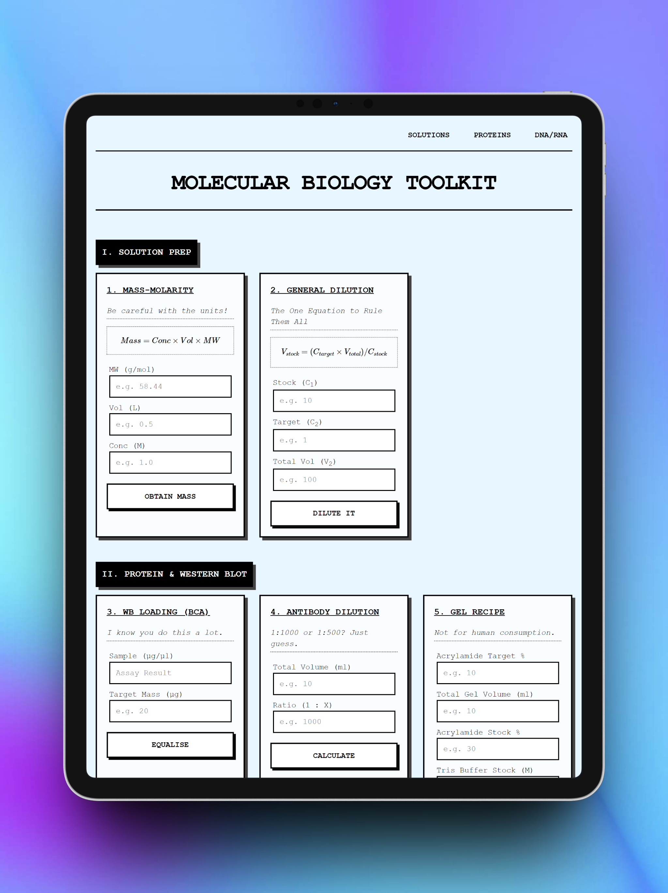

# 🧬 Molecular Biology Toolkit

A lightweight, web-based utility designed for biology lab workers to perform common molecular biology calculations quickly and accurately.

### Online
Visit [Molecular Biology Toolkit](https://sahmed0.github.io/lab-tools/) to use the toolkit.

### Local
I have limited everything to one file so it's easy to install and use for non-technical users.
1. Download the index.html file
2. Open in your browser to use it.
3. Open in an IDE to edit it.

## Features

The toolkit provides 8 essential calculation modules:

1.  **Mass-Molarity**: Calculate the mass required for a specific molar concentration and volume.
2.  **General Dilution**: Quickly compute $C_1V_1 = C_2V_2$ dilutions.
3.  **WB Loading (BCA)**: Equalize protein mass for Western Blot loading.
4.  **Antibody Dilution**: Calculate antibody and buffer volumes for specific ratios.
5.  **Gel Recipe**: Generate precise recipes for SDS-PAGE casting (Acrylamide, Tris, SDS, etc.).
6.  **Nucleotide Quantification**: Determine DNA/RNA concentration from $A_{260}$ absorbance.
7.  **Purity Check**: Analyze $260/280$ and $260/230$ ratios for contamination.
8.  **Mass to Moles**: Convert DNA mass (ng) to moles (pmol) based on base pair length.

## Design & Philosophy

-   **Simple UI**: High-contrast, monochrome-adjacent theme with large buttons and legible fonts, all in one page to minimise context-switching.
-   **Mobile First**: Fully responsive design optimised for iPads and smartphones, featuring large touch targets and readable typography.
-   **Lighthearted Tone**: Includes a touch of sarcasm to keep your long hours in the hood interesting.

## Tech Stack

-   **HTML5/CSS3**: Pure vanilla code for maximum performance.
-   **JavaScript**: ES6+ logic for instant calculations.
-   **MathJax**: High-quality LaTeX-style mathematical rendering.

---
## MIT Licence

This project is licensed under the **MIT Licence**. 

This means you are free to use, copy, modify, and distribute the software for any purpose, including commercial applications, provided that the original copyright notice and this permission notice are included in all copies or substantial portions of the software.

*See the [LICENSE](LICENSE) file for the full text.*
